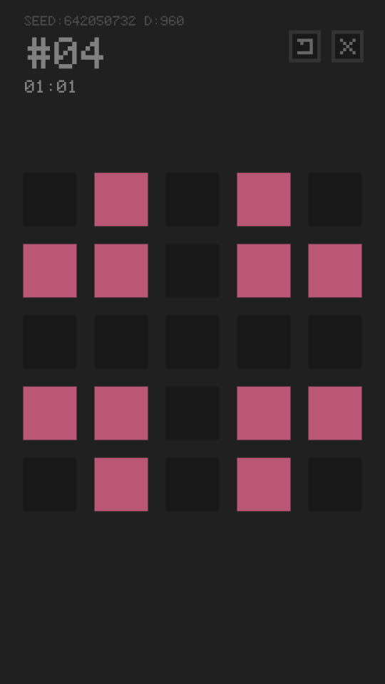
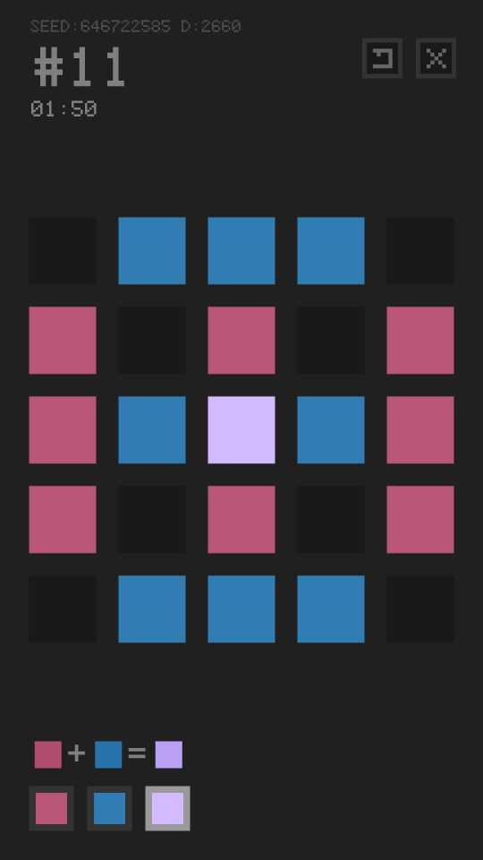
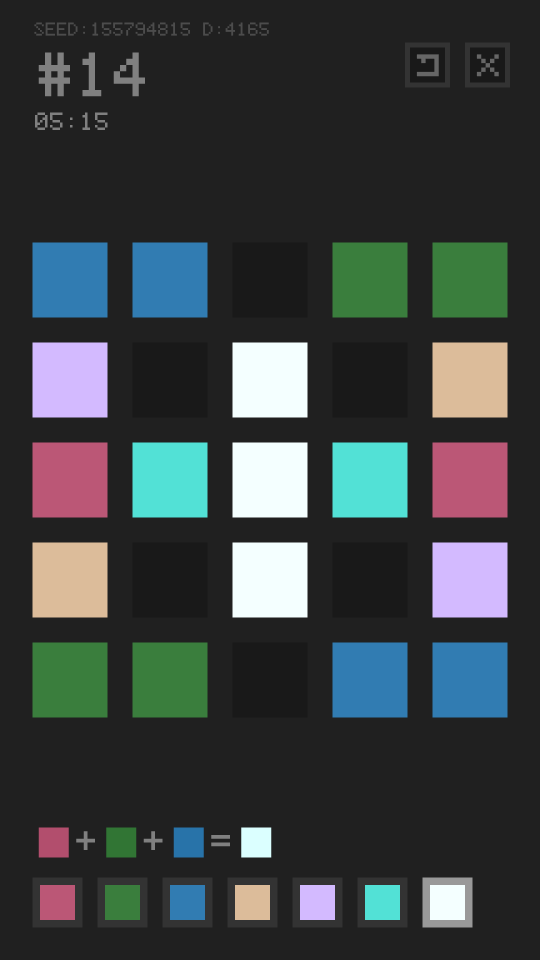

# TRICOLORS

TRICOLORS is a tiny puzzle game inspired by [*Lights Out*](https://en.wikipedia.org/wiki/Lights_Out_(game)), participating [GitHub Game Off 2017](https://itch.io/jam/game-off-2017).

## Introduction

Try removing all colored blocks in a 5x5 map. Solve endless puzzles with increasing difficulties!

This game is inspired by a game *Lights Out* in my childhood memories. Original *Lights Out* game is designed for monocolor screens. I made it much more difficult by coloring the blocks. Each block can be colored red / green / blue, and these 3 colors can be mixed together:

* red + green = yellow
* red + blue = purple
* green + blue = cyan
* red + green + blue = white

## How to Play

[https://lastleaf.github.io/tricolors](https://lastleaf.github.io/tricolors)

Open the URL above in latest Chrome/Firefox (or other browsers with WebGL support). Mobile devices are also supported!

Click the "?" button in game cover for the tutorial.

## Screenshots

## CREDIT

This game is made by LastLeaf (Fu Boquan), for GitHub Game Off 2017.

My GitHub Game Off 2015 and 2016 games (with different teammates) are also available:

* [A Lighted Story](http://mistymiracle.github.io/a-lighted-story/) - the Game Off 2015 game
* [Boxie Coody](http://lastflower.github.io/game-off-2016) - the Game Off 2016 game

## How to Build this game

This game is implemented with WebGL and common HTML5 technologies. You need `nodejs` toolchains to build this game.

1. Clone this repo.
1. Run `npm install`.
1. Run `npm run build`.
1. Open `index.html` in your browser!

## LISENCE

The content of this game is under [Creative Commons Attribution-ShareAlike 4.0 International](https://creativecommons.org/licenses/by-sa/4.0/). The software of this game is under [MIT LICENSE](https://opensource.org/licenses/mit-license.html).
